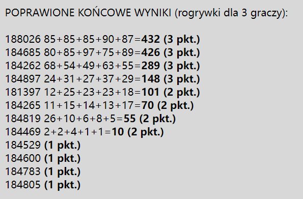

# README
This is a project and match in IT faculty of my first semester. I got champion happily.

It is a [game](http://aleplanszowki.pl/pliki/Trucizna_RULES_PL_web.pdf) ([EnVersion](https://www.fgbradleys.com/rules/rules6/Friday%20the%2013th%20-%20rules.pdf)), that we need create a c++ concole program to simulate it. And create AI as player use different method to play. Then match with other AI.

